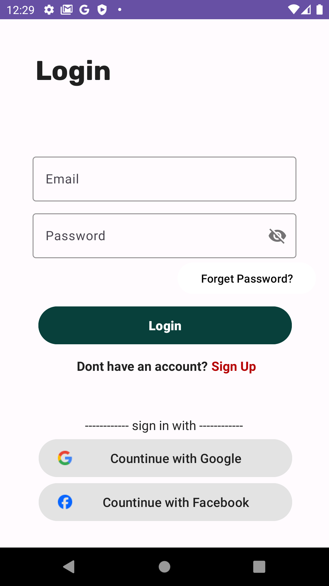
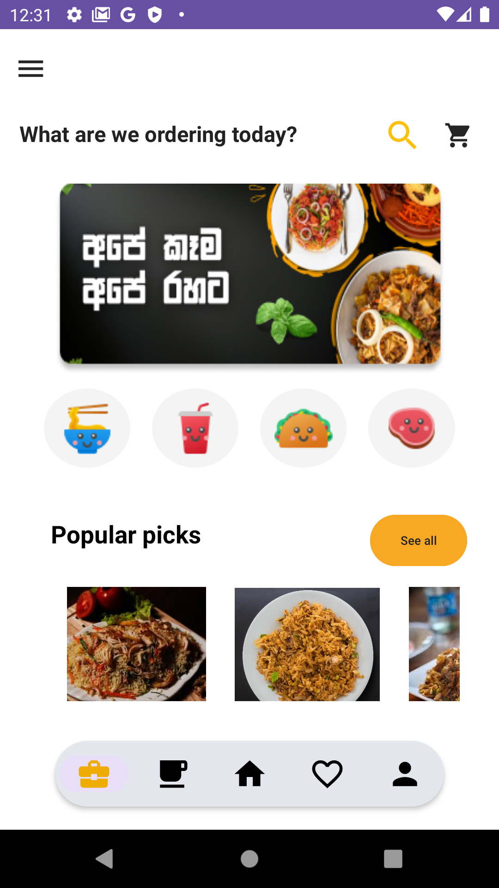
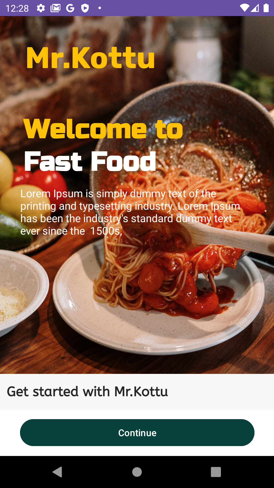

# <h2>Mr_Kottu-AndroidApp<h2>

> [!NOTE]
> MrKottu_admin - This is the app related to Admin.
> 
> Mr_kottu - This is the app related to User.
##
> [!IMPORTANT]
> Mobile Food Delivery application.The purpose of this android app is the ability to order food online, it is a user-friendly mobile app developed with java and firebase.Real-time location tracking via Google Maps enhances transparency. Data is securely stored with Firebase Firestore Storage. 

#
<h3>App Features : </h3>

Mr_kottu => UserApp
- [User Registration and Login ](#User_Registration_and_Login)
- [The Home Page and the Related Food Product ](#The_Home_Page_and_the_Related_Food_Product)
- [Account Update](#Account_Update)
- [Search Food](#Search_Food)
- [User Current Location](#User_Current_Location)
- [Single Product View & Product Card](#Single_Product_View-&-Product_Card)
##
MrKottu_admin => AdminApp
- [Splash](#Splash)
- [Login  ](#Login )
- [Product Registration](#Product_Registration)

## Preview

  |   |  

## License

Gavrawa is released under the [MIT License](https://opensource.org/licenses/MIT). See the `LICENSE` file for more information.

